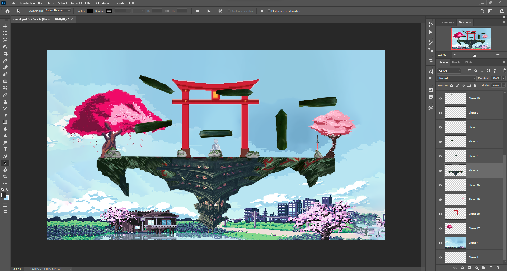
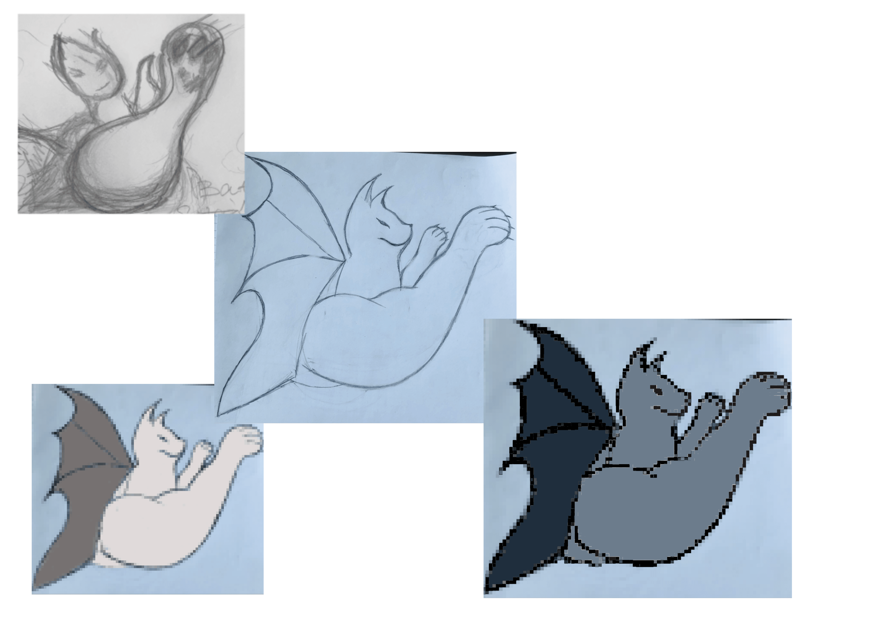
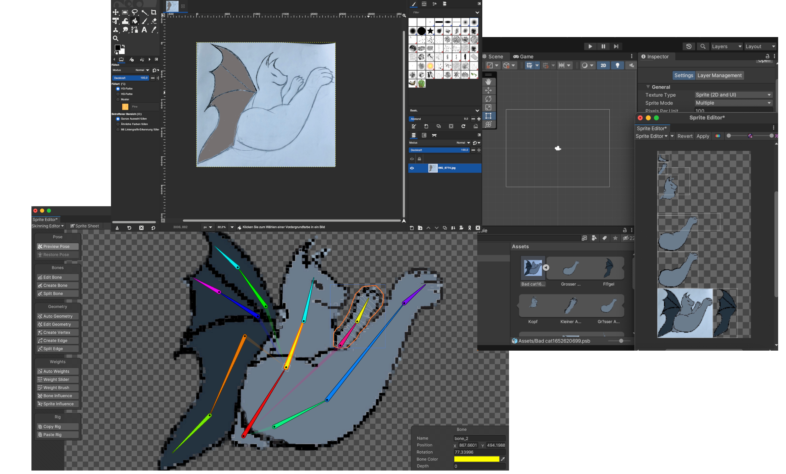
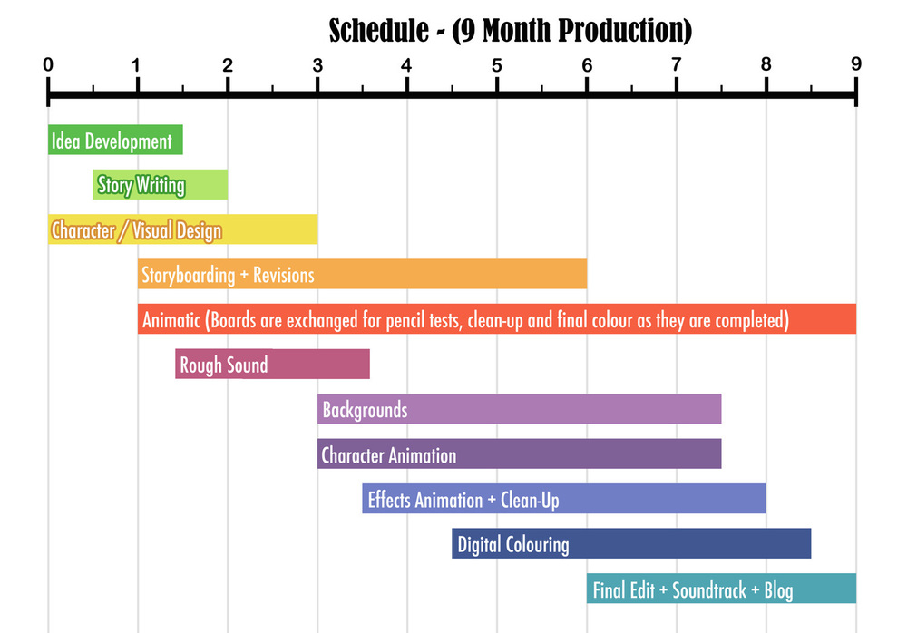
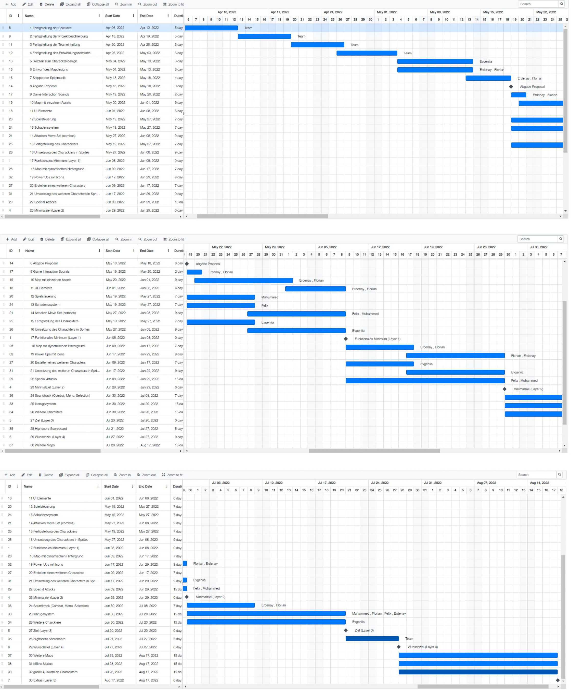

### Titel: Super Smash Ikarugas.

__Informationen entnehmen Sie bitte dem Übungsblatt!__

#### 1.Spielbeschreibung 

Allgemeine Beschreibung:
Das Spiel Super Smash Ikarugas. wurde inspiriert von Super Smash Bros und enthält Elemente von Ikaruga. Im Spiel geht es darum, dass sich 2 Spieler bekämpfen, dabei haben die Charaktere auf eine Steuerung ähnlich wie in Super Smash Bros hin und wieder werden Bullet Rain Elemente von Ikaruga verwendet. Dabei handelt es sich um das sogenannte Polarisieren, welches notwendig um gegebenen Gefahren ausweichen zu können. In dem Spiel muss man also versuchen den Gegner zu bekämpfen und aus der Map zu schmeißen und gleichzeitig muss man den Projektilen auszuweichen. Es wird zudem Powerups geben, die einem Spieler nach dem Aufheben gewisse Vorteile bieten.

Ablauf:
Das Spiel startet grundsätzlich im Hauptmenü. Dort kann man dann aus verschiedenen Spielmodi auswählen. Unser Hauptmodus
ist der normale 1 gegen 1 Modus, der das Standartformat des Fighting Games Genre verkörpert. Dieser Modus ist das Herzstück
unseres Spiels und andere Modi sind dann Ableitungen aus diesem Format. Es kann zum Beispiel noch einen Modus gegen
mehere Bots geben.
Wenn man den normalen Versus-Modus wählt, wird mann in die Charakter- und Mapauswahl weitergeleitet. Dort kann man dann
aus den später verschiedenen Charakteren und Maps auswählen. Wenn man dann seine Auswahl getroffen hat, wird man auf
gegenüberliegenden Spawn-Points auf der Map gespawnt, auf denen man beim Tod auch wieder respawnt wird.
Dann geht der Kampf los. Man kann sich nun mit den verschiedenen Mechaniken, die das Spiel zu bieten hat
(mehr dazu ind en technischen Elementen) Schaden zufügen. Der Spieler, der dem anderen Spieler zuerst alle seine Leben
abzieht, indem er ihm genug Schaden zufügt, sodass er ihn aus der Arena katapultieren kann, gewinnt das Spiel.
Dann gibt es noch einen endgültigen Screen, der den Gewinner und eventuell noch Statistiken über das gerade gelaufene
Spiel anzeigt. Von dort aus kann man dann entweder zurück zum Hauptmenü oder gleich noch eine Runde starten.

Zum Thema Highscores:
Unsere Idee, dass Thema Highscores einzubauen, war es, einen Spielmodus gegen Bots anzubieten, bei dem man sich gegen einen
immer stärkeren KI-Gegner messen kann. Dieser macht pro Runde mehr Schaden, nimmt weniger Schaden und kann auch andere
Vorteile erhalten, die es schwiereiger machen, ihn zu besiegen. Die höchste erreichte Stufe wird dann im Hauptmenü als
Highscore zur Schau gestellt.

**Preview der Map:**

In der Map spiegelt sich das gesamte japanische Spiel-Theme wider. So ist die Map besipielsweise mit Kirschblütenbäumen, Katanas oder auch Torii's beschmückt. Die Plattformen, welche in ständiger Interaktion mit den Spielern stehen, sollen Jade Steine darstellen, deren Vorkommen auch in Japan liegt. Im späteren Verlauf der Spielentwicklung soll zusätzlich noch ein dynamischer 3D-Hintergrund implementiert werden und die Map soll zusätzlich Spawn-Punkte für Power-Ups bieten. Die Map wird außerdem ein wesentlicher Bestandteil des Ikarugasystems sein, besipielsweise ändert sich diese visuell, wenn Bullet Rain Events auftreten.

**Preview des Character Designs:**

The Bat Cat ist eine freche Höllen-Kater von dem Teufel Lucifer, welche irgendwann ihm ganz eigenes Spiel spielen wollte. . Er will einfach alles zerstören was auf seinem weg liegt und sucht  nur passende Gegner um ihm zu besiegen. Da sie die Hölle zu langweilig war, besuchte sie die legendäre Insel Ganjallah. 
Seitdem er klein war, war er von Kämpfen begeistert und wollte auch sich selber gegen die tapferen Kämpfer Ganjallahs beweisen.  Je mehr Gegner sie treffen kann, desto mehr amüsiert sie sich.

#### 2.Technische Elemente

Es ist ein 2D Spiel mit Pixelgrafik. Der Hintergrund ist allerdings in 3D, ähnlich wie in Hollow Knight.
Die Spieler haben Zugriff auf die folgende Steuerung:
Crouch, Sprung, Block und Attacken, wie Luft- und Bodenattacken, Specials, sowie Up und Downattacken.
Jeder Charakter hat die normal Angriffe, die sich höchstens in Reichweite und Angriffsgeschwindigkeit unterscheiden.
Jedoch unterscheiden sie sich dann stärker in ihren speziellen und einzigartigen Fähigkeiten und eventuell noch
passiven Fähigkeiten. Dadurch bietet jeder Charakter seinen eigenen Spiel-Stil mit taktischen Vor- und Nachteilen.
Zudem wird es ein Bullet Rain, ähnlich wie beim Spiel Ikaruga geben, wo sich die Spieler
dann der Projektilfarbe entsprechend polarisieren müssen, da sie ansonsten Schaden erhalten.
Der Schaden führt dazu, dass die Schwerkraft einen geringeren Einfluss auf den Spieler hat, was dann dazu führt,
dass dieser leichter aus der Map geschmissen werden kann.
Man verliert ein Leben, wenn man außerhalb des sichtbaren Spielfelds ist, also wenn man von der Map fällt oder
durch Schaden an einer der Ränder geworfen wird. Dann respawnt man wieder mit 0% Schadensmultiplikator.
Die Powerups, die spawnen können, können den Spieler regenerieren lassen oder temporär einen Schadensbonus geben.
Diese spawnen dann immer zufällig an bestimmten Stellen auf der Map in unregelmäßigen Abständen.

UI:
In Game:
Im Spiel soll man seine eigenen Leben und den Prozentsatz an genommenem Schaden sehen. Diese Zahl soll auch die
Farbe verändern, wenn man mehr Schaden genommen hat und somit von weiß von rot gehen.

Character/Map-Auswahl:
Hier kann man die verschiedenen Charaktere und Maps anhand von Preview-Bildern sehen und sich danach dann
entscheiden, welchen man spielen möchte.

Main Menu:
Buttons für die verschiedenen Modi, eventuell Einstellungen, um spezifische Veränderungen an dem Standart-Spielerebnis
vorzunehmen, wie zum Beispiel den Schadensmultiplikator zu verringern oder die maximale Lebensanzahl zu verändern.
Der Hintergund soll eine gestalterisch eine unscharfe Verison unserer Haupt-Map sein.
Dazu kommt dann noch ein EXIT-Button und ein allgemeines Einstellungsmenü für Lautstärke und Ähnliches.

Controls:
Es soll möglich sein, das Spiel zu zweit an einer Tastatur zu spielen. Aber es soll, wenn realisierbar, auch möglich sein,
dass Spiel mit zwei Controllern zu spielen.

#### 3. "Big Idea"

Die Big Idea ist die Verknüpfung von Super Smash Bros. und Ikaruga.
Durch die PvP Aspekte und dem gleichzeitigen Bullet Rain muss der Spieler stets
sehr fokussiert sein, um auf viele Sachen gleichzeitig achten zu können.

#### 4. Entwicklungszeitplan

Layer 1: 1 Map, 1 Charakter, 1 Attacke und Schadenssystem.
Layer 2: Ikarugasystem, mehr Attacken.
Layer 3: Steuerung komplett ausgebaut, Visuelle Elemente (Animationen, Feedback)
Layer 4: 2 Maps, 2 Charaktere
Layer 5: KI Gegner, eine Vielfalt von Charakteren, eigene Animationen, weitere Spielmodi

**Gantt Chart:**

#### 5. Teamaufteilung

Muhammed: Programmierer, Qualitätssicherung
Florian: Künstler
Felix: Programmierer
Erdenay: Produzent, Künstler, Programmierer
Evgeniia: Künstlerin
