**02 Alpha Release**  

Wir haben bis jetzt die ersten 3 Layers implementiert.
Wir haben uns ein wenig an der 4. Layer probiert, es aber aus Zeitgründen nicht umsetzen können. Die Systeme für Erweiterungen sind aber druchaus schon platziert und das Spiel ist auch mit Skalierbarkeit im Hinterkopf designt.

Layer 1:  
1 Map und 1 Charakter hinzugefügt  
1 Attacke: Normaler Angriff  
Schadenssystem: Rückstoß und Schadensanzeige funktionieren  

Layer 2:  
Ikarugasystem funktioniert  
mehr Attacken: Fernkampfangriff 

Layer 3:  
Steuerung komplett ausgebaut: Springen, rollen, blocken, Pausemenü, Bewegung und Attacken funktionieren für beide Spieler  
Animationen: Asset Store und physikalische Bewegung von Unity  
Feedback: Sound für alle Interaktionen hinzugefügt   

**Unser Spiel hat jetzt die folgenden Features:**

**UI:**  
Wir haben ein Hauptmenü, eine Hauptspielszene und einen Victory-Screen.
Im Hauptmenü kann man gibt es noch die Möglichkeit, den Charakter und die Map auszuwählen, da wir aber für beides bis erst eine Möglichkeit haben, ist diese Funktion noch ohne Nutzen.  
Wenn man eine Partie gespielt hat und ein Spieler siegreich war, kann man sich dann noch entscheiden, ob man direkt neu starten will oder ob man zurück zum Hauptmenü möchte.  
Im Spielgeschehen hab wir eine feste Kamera, ein HUD für die Leben und Schadenswerte der Spieler und natürlich die Map mit den zwei Spieler-Charakteren. Auf der Map gibt es eine große Hauptplatform und 5 kleinere Platformen, auf die man springen kann. Man kann dabei von unten oder von der Seite durch die Platformen durchspringen und dann darauf landen.
Außerdem kann man mit ESCAPE ein Pausemenü aufrufen, auf dem man auch die Steuerung für beide Spieler sehen kann.
  
**Hauptmenü:**  
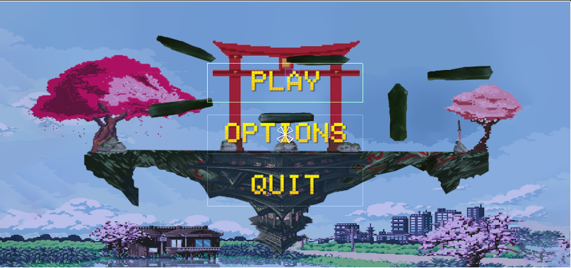

**Optionen:**  
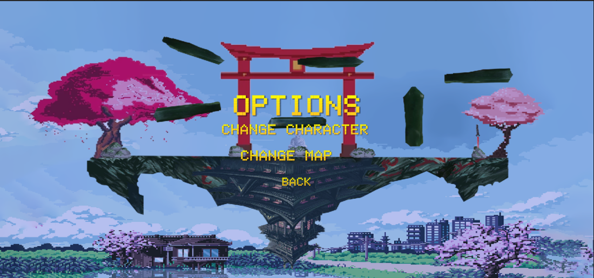

**Ingame-HUD:**  
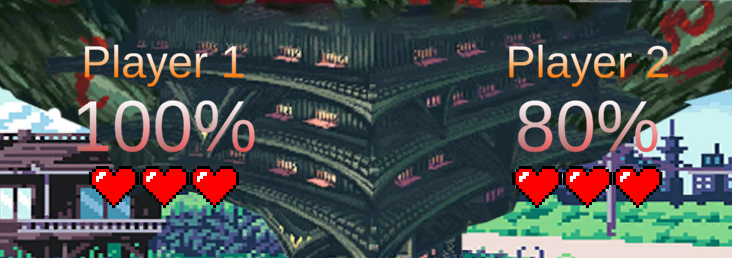

**Pausemenü:**  
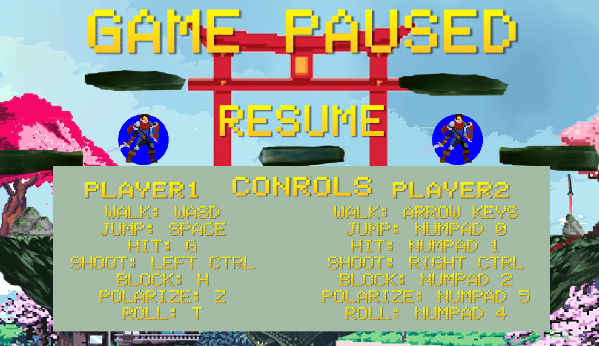

**Gewinner-Screen**  
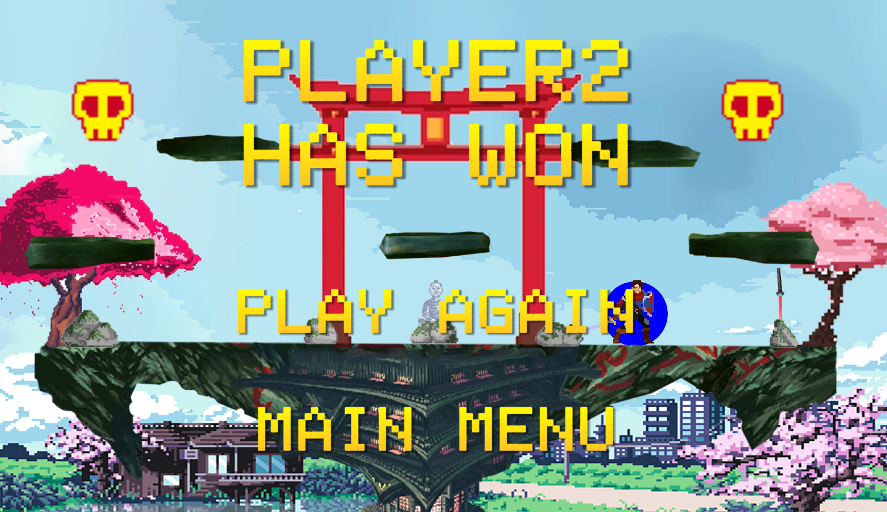
  
**Gameplay:**  
Wir haben bis jetzt unseren Haupt-Spielmodus, das klassische 1 gegen 1, umgesetzt. Dabei starten beide Spieler mit 3 Leben und müssen sich gegenseitig Schaden zufügen, um den Rückstoß ihrer Schläge gegeneinader zu erhöhen und den anderen aus der Arena (an den Rand des Screens) zu befördern.  
Man kann dabei normal schlagen, schießen, springen, blocken, rollen und sich umpolarisieren.  
Das Umporalisieren braucht man, wenn das Ikaruga-System einsetzt. Dieses lässt periodisch einen von 3 verschiedenen Projektilregen starten. Dabei können sich die SPieler weiterhin gegenseitig Schaden zufügen, während sie entweder durch richtiges polarisieren oder gekonntes Ausweichen die vom Himmel fallenden blauen oder roten Feuerbälle vermeiden müssen.  
Außerdem spawnt in der Mitte der Arena auch periodisch ein Apfel, der den Spieler heilt, der ihn einsammelt.
Wer zuerst den Gegner 3 mal aus der Arena befördert, gewinnt das Spiel.  

**Schuss:**  
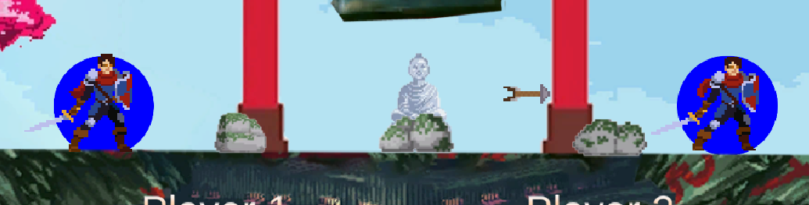

**Items:**  
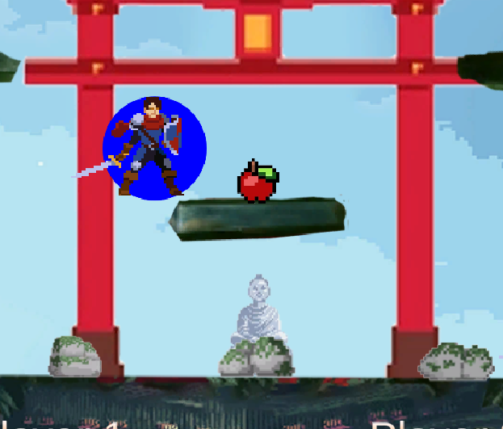

**Ikarugasystem:**  
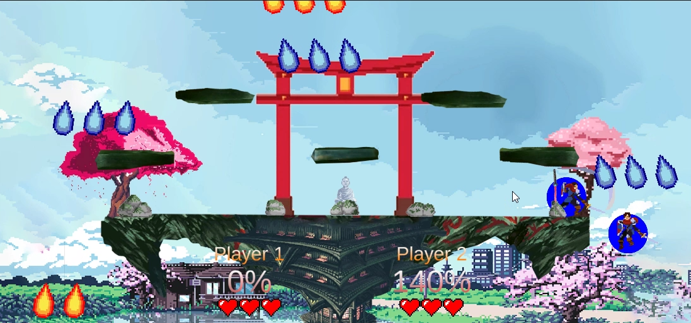
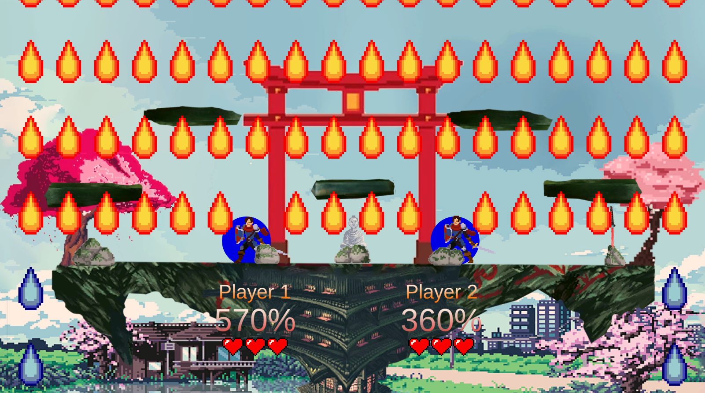
  
**Sound:**  
Auch Sound soielt bei uns eine große Rolle. Jede Aktion des Charkters hat einen eigenen Sound. Es gibt einen Haupt-Soundtrack der während des Spiels und in einer abgeändert Version auch im Hauptmenü spielt.  
Dazu gibt es noch Sounds für das Ikaruka-System und wenn der Spieler Schaden nimmt.

**Schwierigkeiten:**  
**git:**  
Anfangs hatten wir Schwierigkeiten mit git unsere Anteile zusammenzubringen, wodurch auch unsere anfangs noch orndentliche Ordnerstruktur nach einigen Pushes sehr stark gelitten hat, vor allem wenn bei merges die Struktur im privaten Arbeitsberiech nicht eingehalten wurde. Jetzt sind die Ordner undurchsichtig und manchmal sogar doppelt, werden aber von verschiedenen Systemen an verschiedenen Stellen benutzt.  
**Lösung:**
Beim nächsten mal sollte sich jeder strikt an diese Strukturen halten, um eine übersichtliche Ordnerstruktur beizubehalten.

**Rückstoß:**  
Von der Programmierseite fiel und besonders schwer, ein sinnvolles Rückstß-System einzubauen, da die Bewegung des Charakters auch von anderen System beeinflusst wurde und die verschiedenen Funktionen alle mit dem Rückstoß zusammen funktioneren müssen. Außerdem muss der Rückstoß sich physikalisch richtig anfühlen und in die richtige Richtung geschehen. Das war auch eine Herausforderung.  
**Lösung:**
Eventuell versuchen, Movement und Rückstoß zu trennen, sodass sie nicht auf den gleichen physikalischen Funktionen basieren und sich nicht gegenseitig beeinflussen.  

**Movement:**  
Auch hier war die größte Schwierigkeit, alles so zu machen, das es sich physikalisch richtig anfühlt und mit den anderen Systemen richtig interagiert. Es war defnitv schwieriger als gedacht, das alles zu berücksichtigen, nur damit sich der CHarakter richtig bewegt, umdrehen kann, springen kann und mit den Plattformen und dem anderen Spieler richtig interagiert.

**Plattformen Collider:**  
Auch die Plattformen haben viele Hürden aufgewiesen. Oft gab es Probleme zwischen den Collidern des Spielers und der Interaktion mit den Plattformen. Manchmal hing der Spieler-Charakter an Kanten fest, der Sprung wurde nicht richtig zurückgesetzt, wenn man den Boden berührt hat oder der Charakter ist gar nicht erst auf den Plattformen gelandet. Die vorgefertigten Unity 2D Komponenten haben uns dabei eineige Arbeit abgenommen, aber es war trotzdem knifflig, die richtigen Funktionen und Komponenten zu finden und es haben sich immer komische Bugs eingeschlichen, die uns das Leben schwer gemacht haben.  
**Lösung:** Sich mehr mit den Collider-Komponenten von Unity auseinandersetzen.

**Plattform Interaktion:**  
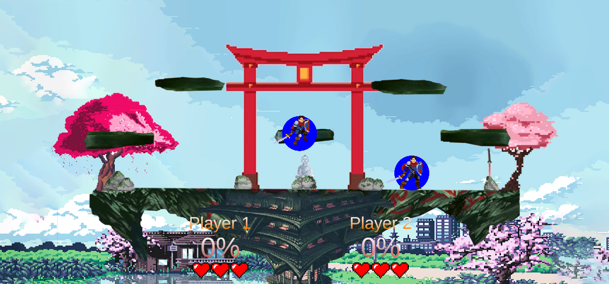

**Einfacher als gedacht:**  
**Unity:**  
Für viele von uns war das das fast erste mal, dass wir mit Unity direkt arbeiten.  
Aber durch die Fülle an Tutorials, Dokumentationen und das logische und intuitive Design der Anwendung an sich, fiel es uns erstaunlich leicht, uns in Unity einzuarbeiten und zufriedenstellende Resultate zu erreichen. Wir haben uns nicht durch den Editor eingeschränkt gefühlt und oft hat er uns sogar unerwartet Arbeit abgenommen, sei das durch eine vorgefertigte Komponente, wie die Collider oder druch die bereits guten Grundeinstellungen der meisten GameObjects und die vielen gut beschriebenen Attribute.  
Wir waren allgemine sehr posititv überrascht, wie einfach es eigentlich ist, mit Unity Spiele zu designen. Es sind einem kaum Grenzen gesetzt.  

**Game-Scene:**  
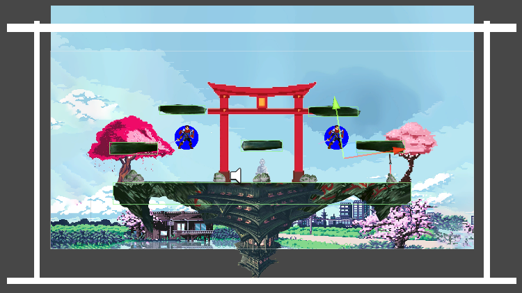

**Ikaruga-System:**  
Auch hier hat Unity uns das Leben leichter gemacht. Durch die Prefabs für die Projektile des Ikaruga-Systems war es sehr leicht dutzende Projektile gleichzeitig zu erstellen und in verschiedenen Mustern abzufeuern.  
Die Hitboxes haben wir auch mit den von Unity zur Verfügung gestellten Collidern umgesetzt, was auch nur wenige Zeilen Code brauchte.  

**Aufgaben mussten wir abbrechen:**  
**Eigener Charakter:**  
Wir hatten und anfangs vorgenommen einen eigenen Charakter mit eigenen Animationen zu kreieren.  
Wir haben allerdings sehr schnell wie unglaublich aufwendig so etwas ist und uns deshalb dazu entschieden, auf den Asset-Store von Unity zurückzugreifen und uns auf das Gameplay und die anderen Bestandteile zu fokusieren.

**Weitere Attacken:**  
Auch Animationen für die eine Extra-Attacke und weitere Attacken mussten erstmal nach hinten verschoben werden, da wir es nicht geschafft haben. Auch war es schwierig diese zu implementiert, da wir schon so viele ineinander übergreifen de Systeme bei dem Spieler-Charakter haben, das jede Erweiterung viel Veränderung und Berücksichtung in allen Komponenten benötigt.

**Starke Umpriorisierung:**  
Der Zeitplan hat sich generell um eine Woche verschoben.
Sonst haben wir das meiste zu den geplanten Zeiten fertig bekommen, allerdings war das Zusammentragen über git eine große Herausforderung und hat wesentlich mehr Zeit in Anspruch genommen, als wir gedacht hätten, weil dann erst viele Bugs gefunden wurden, die durch das Interagieren der verschiedenen Funktionen aufkommen.
Außerdem sind einem auch immer wieder Ideen gekommen, die man dann außerhalb des Zeitplans umgesetzt hat.

