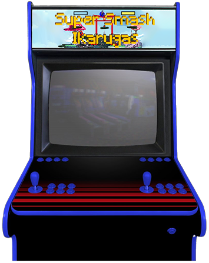
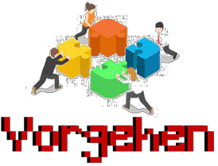
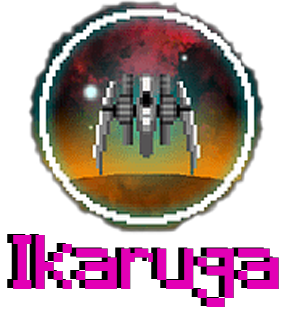
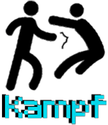
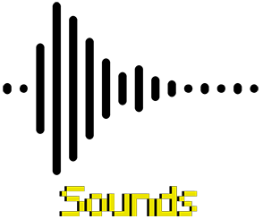
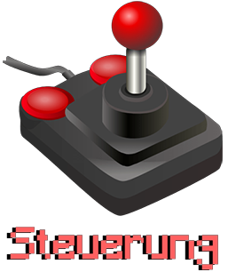
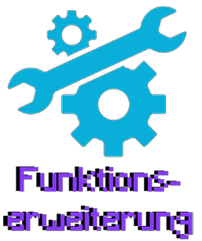
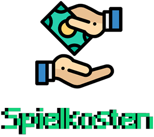

**03 Playtesting**

**Testpersonen**
- Freunde
- Kommilitonen
- Geschwister

**Vorgehen:**  
Wir haben mit unseren Testpersonen jeweils nach kurzem Erklären der Steuerung ein paar Runden gespielt und ihnen dann ein paar Fragen zu dem Erlebnis gestellt.  
Die Ergebnisse haben wir hier gesammelt und zusammengefasst.

**Was hat dir am besten gefallen?**  
Viele haben gesagt, dass ihnen das actionreiche Gameplay am besten gefällt. Besonders die Kombination  
mit dem Bullet-Hell von Ikaruga war am Anfang etwas überfordernd, hat aber nach ein paar Runden sehr viel Spaß gemacht,  
da man dadurch dann durch besonders gutes Gameplay beweisen kann. Gerade, dass man durch das richtige Polarisieren seine ultimative Fähigkeit öfter einsetzen kann, um Runden zu gewinnen, hat sich gut angefühlt.  
Auch wurden oft die Sounds und die selbstgemachte Musik gelobt.

**Wie findest du das Ikaruga-System?**  
Die Verbindung von Smash und Ikaruga hat den Testpersonen gut gefallen und sie meinten, dass es gut zusammenpasst  
und die Geschwindigkeit und das Skill-Cap sehr stark erhöht, wenn man es richtig spielt.  
Allerdings wurden die 3 verschiedenen Muster sehr schnell repetetiv und vorhersehbar und es wurden sich noch komplexere Muster gewünscht.

**Wie hat dir das Kampf-System gefallen?**  
Das Kampf-System fanden die Tester im Allgemeinen gut. Es kam ihnen von den paar Runden her ausgeglichen vor und  
die Zahlen haben auch Sinn gemacht.
Es ist etwas verwirrend, dass man 2 mal den gleichen Charakter auf dem Screen hat, da wir zur Zeit nur einen Charakter haben.
So verliert man manchmal aus den Augen, welcher der beiden Charaktere man ist.
Außerdem hat sich ein Teilnehmer beschwert, dass das Parieren zu stark ist.

**Wie findest du das Map- und Charakter-Design?**  
Das Mapdesign hat den Testern gut gefallen, allerdings wollten einige Tester auch gerne komplexere Maps sehen.
Wir haben erst 2 Maps, die noch realtiv schlicht gehalten sind mit wenigen Plattformen und würden auf Grund des Feedbacks als nächstes dann an einer komplexeren Map mir mehr Interaktionsmöglichkeiten arbeiten.

**Wie fandest du die Musik und die Sounds?**  
Die Sounds und die Musik haben allen sehr gut gefallen. Diese waren ein bisschen zu laut, aber das lässt sich leicht anpassen.
Sie sorgen für eine sehr gute Atmosphäre und tragen zur Action bei.
Einer dachte, dass wir die Musik aus dem Internet haben. Als wir ihm erklärt haben, dass wir nur die Soundeffekte aus dem Internet haben und die verschiedenen Musik-Tracks selber erstellt haben war er sehr beeindruckt.

**Wie komplex fandest du die Steuerung?**  
Die Steuerung ist fast allen Testern direkt negativ aufgefallen. Die Tasten waren teilweise zu weit auseinander oder verwirrend.
Nach ein einigen Diskussionen sind wir uns immer einig geworden, dass es schwierig ist für 2 Spieler an einer Tastatur eine sinnvolle Steuerung hinzubekommen und dass das Spiel viel besser mit Controllern funktionieren würde.

**Was war das größte Problem?**  
Das größte Problem war für fast alle die Steuerung, wie wir schon in der Frage davor festgestellt haben.  
Eine Person hat sich über das zu starke Parieren beschwert.

**Fällt dir noch eine weitere wichtige Funktion oder Erweiterung des Spiels ein?**  
Zuerst kam natürlich wieder das Thema der Charaktervielfalt auf, da Fighting Games hauptsächlich durch den Spielspaß  
der verschiedenen Charaktere und dazugehörigen einzigartigen Mechaniken glänzen.  
Des Weiteren wurde uns ein Story- oder Challenge-Modus noch empfohlen.  
Einer meinte auch, dass das Spiel mit 4 Spielern noch viel besser wäre und man es so sogar online im Multiplayer spielen könnte, anstatt nur lokal auf einem Screen.  
Außerdem wurden sich noch mehr Einstellungsmöglichkeiten gewünscht. Zum Beispiel mehr Leben oder die Häufigkeit der verschiedenen Mechaniken sowie mehr einsammelbare Items.

**Würdest du das das Spiel weiterempfehelen und wenn ja, wem?**  
Wir bekamen das Feedback, dass die Tester es weiterempfehelen würden, wenn es fertig gebracht werden würde.  
Gerade, weil es nicht sehr viele Spiele wie Smash gibt, würden sie es besonders Spielern empfehlen, die die Smash-Games  
oder generell Fighting-Games mögen.

**Wie viel wärst du bereit für das Spiel zu bezahlen, wenn es noch erweitert wird?**  
Die Preise, die die Tester für das Spiel bezahlen würden, wenn es noch mehr Charaktere und Maps geben würde,  
war in einem Bereich von ca 5 bis 15 Euro.  
Vielleicht noch bis zu 30 Euro, wenn es einen ausgiebigen Storymodus und weitere Spielmodi geben würde.  
Uns wurden als weitere Geschäftsideen noch DLC-Maps oder -Charaktere und ein Gacha-System für das Erlangen  
der Charaktere vorgeschlagen.

**Wie oft und wo würdest du das Spiel spielen wollen?**  
Hier haben wir erfahren, dass die meisten das Spiel als Gelegenheitsspiel sehen. Man spielt es nicht für mehrere Stunden am Stück,  
sondern meistens nur ein paar Runden, gerade, wenn man Besuch von Freunden hat, könnte es sehr viel Spaß machen ein paar Runden zu spielen.  
Bei dieser Frage wurde sich auch erneut eine Erhöhung der Spieleranzahl gewünscht.  
Auch würde hier die Einführung eines Online-Modus die Replayability drastisch erhöhen, da es zum jetzigen Standpunkt ohne Story-Modus  
wenig Sinn macht, es alleine zu spielen.

**Fazit:**  
Im Allgemeinen waren alle Tester sehr zufrienden mit dem Spiel und meinten sie hatten Spaß über die paar Runden.  
Man konnte direkt eine Verbesserung über nur wenige Spiele merken und dass das Skill-Cap realtiv hoch ist, was wir auch erreichen wollten.  
Alle meinten, dass die Verbindung von Smash und Ikaruga gut harmoniert, was uns auch in unserer grundlegenden Idee bestärkt hat.  

Gewünscht wurde sich haupsächlich Controller-Support und natürlich mehr Maps und Charaktere.
Das Spiel bietet eine gute Grundlage, um dann noch mehr einzigartige Charaktere mit verschiedensten Fähigkeiten hinzuzufügen.  

Das Feedback unserer Testpersonen aus dem Playtesting hat sich mit den Mängeln, die wir uns bereits vorgestellt haben, gedeckt.
In der Zukunft werden wir, wenn wir es noch schaffen, Controller-Support hinzufügen, ein paar Zahlen anpassen (Sound-Lautstärke, Parieren)  
und noch speziellere Einstellungen hinzufügen.
Wenn wir das Projekt noch nach diesem Modul weiterführen würden, dann müssten wir auf jeden Fall noch mehr Charaktere und neue Fähigkeiten hinzufügen. Auch könnte man über neue Spielmodi nachdenken und einen Online-Multiplayer hinzufügen.

